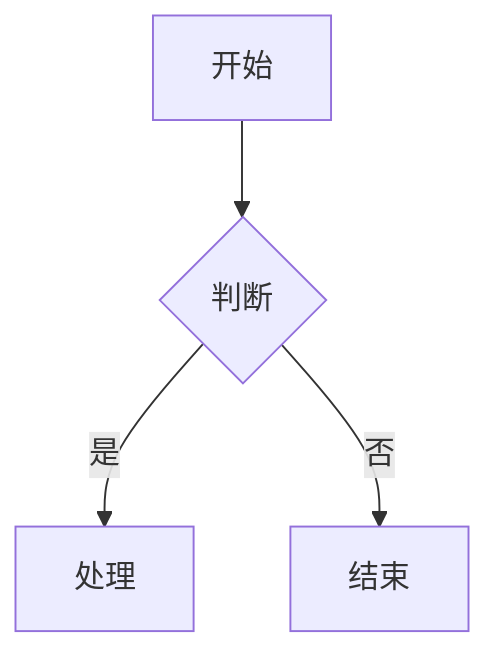

## 引言

这是专为演示而写的博客文章。你可以在首页的 Blog 页面看到它的卡片。

- 支持数学公式：$E=mc^2$
- 支持 Mermaid 图表：

```mermaid
flowchart TD
  A[开始] --> B{判断}
  B -- 是 --> C[处理]
  B -- 否 --> D[结束]
```

## 正文

内容渲染与文档一致，复用了相同的 MDX 配置与组件。

> 提示：你可以继续在 content/blog 下新增更多文章，前置属性里添加 author、date、cover 等信息。