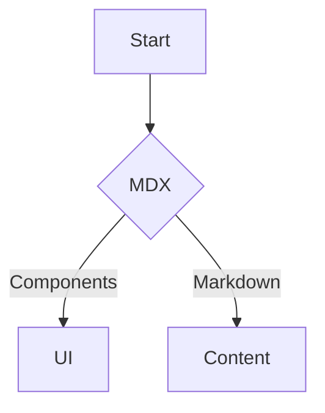

MDX 让我们可以在 Markdown 中使用 React 组件，既保留了良好的写作体验，又带来了高可扩展性。

## 模块化组件

- 用 Callout、Tabs、CodeBlock 等组件封装“可复用结构”；
- 将交互脚本封装为轻组件，避免在正文内直接写复杂逻辑。

## 内容组织

- 约定 frontmatter 字段：title/description/author/date/cover；
- 通过目录（TOC）与相对链接组织跨页阅读。

## 示例：Mermaid 与公式

行内公式示例：$E=mc^2$。

> 建议：将“内容模型”与“渲染组件”解耦，长期收益显著。